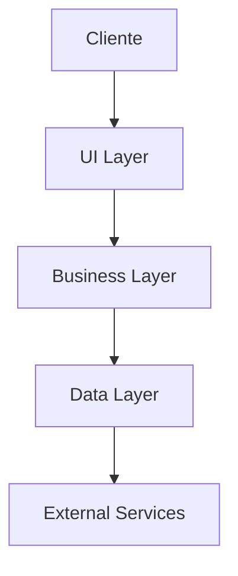

# Arquitetura do Projeto TERMOS

## Visão Geral da Arquitetura

O projeto TERMOS segue uma arquitetura em camadas com foco em modularidade e separação de responsabilidades.

## Camadas da Aplicação

### 1. Camada de Apresentação (UI)
- Components React
- Páginas Next.js
- Gestão de Estado
- Rotas e Navegação

### 2. Camada de Lógica de Negócios
- Serviços
- Validações
- Transformação de Dados
- Regras de Negócio

### 3. Camada de Dados
- APIs
- Caching
- Persistência
- Modelagem de Dados

## Padrões de Design

- Repository Pattern
- Factory Pattern
- Singleton Pattern
- Observer Pattern
- Strategy Pattern

## Fluxo de Dados

## Considerações de Segurança

1. Autenticação
2. Autorização
3. Validação de Dados
4. Proteção contra Ataques

## Estratégias de Cache

- Client-side Cache
- Server-side Cache
- CDN Cache
- Database Cache

## Escalabilidade

- Horizontal Scaling
- Load Balancing
- Microservices Ready
- Database Sharding
